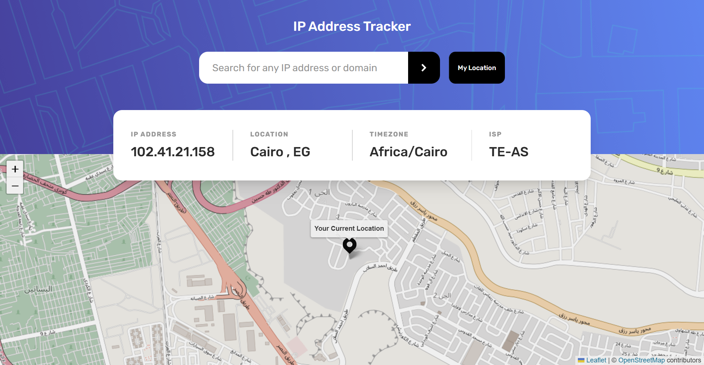
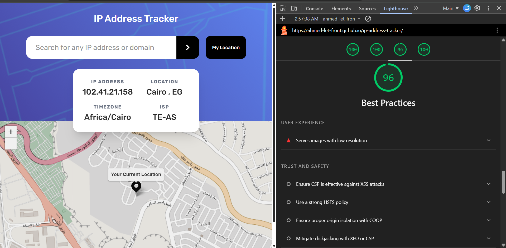
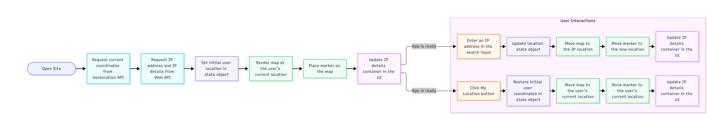

# IP Address Tracker

## Overview & Project Scope

Welcome to the **IP Address Tracker** web application, a modern, highly interactive, and responsive tool designed to look up IP locations, inspect ISP details, and track geographic locations seamlessly on an interactive map.

## Hero Preview



> **Note on Location Accuracy:** Please note that the IP geolocation API tracks the general region or the Internet Service Provider's central routing station (ISP exchange node) rather than your exact physical doorstep, which is standard behavior for IP-based geolocation tracking.

## Links

- **Live Demo URL:** [https://Ahmed-let-front.github.io/ip-address-tracker/](https://Ahmed-let-front.github.io/ip-address-tracker/)
- **Frontend Mentor Solution:** [https://www.frontendmentor.io/challenges/ip-address-tracker-I8-0yYAH0](https://www.frontendmentor.io/challenges/ip-address-tracker-I8-0yYAH0)

## Lighthouse Performance Audit



> **Accessibility Note:** As seen in the Lighthouse audit, the Accessibility score is 96/100 due to minor contrast or asset warnings originating from third-party map library elements and icon attributes.

## AI Collaboration

- 🤖 **UI & Layout Assistance:** AI collaboration was utilized exclusively to assist with structuring and refining the user interface (UI) and layout architecture. All core application logic, DOM manipulation, and programming were independently engineered and implemented by the author.

---

## Logic Flowchart



---

## Core Features & Logic Pipelines

- 🔍 **IP & Domain Lookup:** Search for any IP address or domain to instantly retrieve accurate location data, timezones, and provider details.
- 🗺️ **Interactive Leaflet Maps:** Dynamic map integration with smooth panning (`flyTo`) and custom location markers.
- ⚡ **Instant UI Updates & State Management:** Clean separation of concerns with asynchronous handlers, timeout mechanisms, and robust error handling.
- 📱 **Fully Responsive Layout:** Optimized for mobile, tablet, and desktop viewports with a modern design system.

## Tech Stack & Implementation Details

- 🧱 **Semantic HTML5 Markup:** Clean, accessible, and structured DOM hierarchy leveraging custom attributes and proper landmarks.
- 💻 **Vanilla JavaScript:** Structured asynchronous JavaScript utilizing ES6 modules, Fetch API, and Promise handling.
- 🎨 **Tailwind CSS v4:** Utility-first styling utilizing modern CSS features, responsive grid layouts, and custom design variables.
- ⚡ **Vite:** Next-generation frontend tooling ensuring fast HMR and optimized production bundling.

## What I Learned & Architectural Highlights

- Learned how IP geolocation APIs function and understood that they return the central routing region of the ISP rather than exact physical coordinates.

---
## Project Initialization & Local Setup

To run this project locally, follow these steps:

### 1. Clone the repository:

```bash
git clone https://github.com/Ahmed-let-front/ip-address-tracker.git
```

### 2. Navigate to the project directory:

```bash
cd rest-countries
```

### 3. Install dependencies:

```bash
npm install
```

### 4. Start the development server:

```bash
npm run dev
```

### 5. Build for production:

```bash
npm run build
```

---

## Vite Build Configuration

The project uses an optimized **vite.config.js** file tailored for production asset bundling and vendor chunk splitting:

```javascript
import { defineConfig } from 'vite';
import tailwindcss from '@tailwindcss/vite';

export default defineConfig({
  plugins: [tailwindcss()],
  base: '/ip-address-tracker/',
  build: {
    sourcemap: false,
    rollupOptions: {
      output: {
        assetFileNames: 'assets/[name]-[hash][extname]',
        chunkFileNames: 'assets/[name]-[hash].js',
        entryFileNames: 'assets/[name]-[hash].js',
        manualChunks(id) {
          if (id.includes('node_modules')) {
            return 'vendor';
          }
        },
      },
    },
  },
});
```

---

## Author

- GitHub: [ahmed-let-front](https://github.com/Ahmed-let-front)
- Frontend Mentor: [Ahmed yasser](https://www.frontendmentor.io/profile/Ahmed-let-front)
- LinkedIn: [Ahmed Yasser](https://www.linkedin.com/in/ahmed-yasser-frontend/)

---

**Thanks** Created By **Ahmed Yasser** ❤️